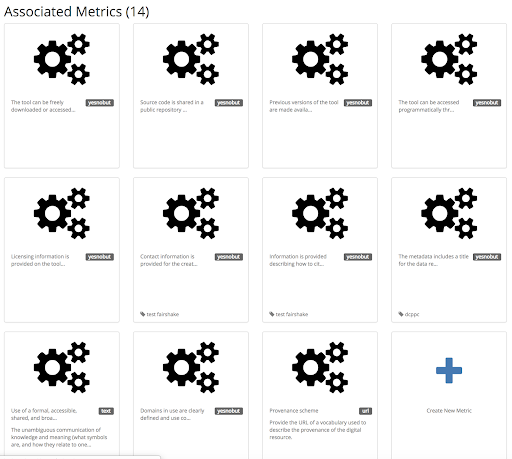
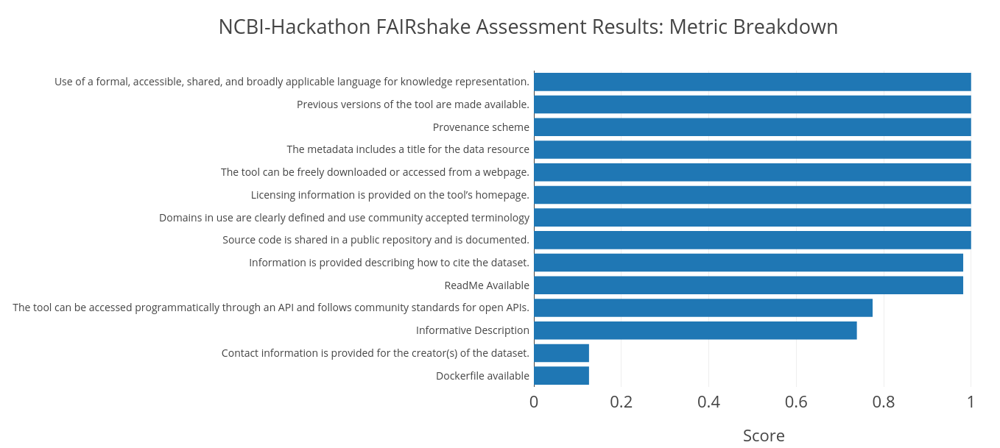

# FAIRy-COMPASS: FAIRness-Evaluation-of-NCBI-Hackathon-Digital-Objects-using-FAIRshake

## Premise
Assess the FAIRness of NCBI-Hackathon Tools on GitHub (and possibly DockStore)

## Abstract

FAIR (Findable, Accessable, Interoperable, Reusable) concepts have traditionally been linked to the concept of biomedical research data; we argue the same ideology should be applied to bioinformatics tools as well. 
An increased emphasis on strengths and weaknesses of various tools and workflows can better enable reproducibility. 
Such an assessment is important for the following reasons:

1. Alerts tool owners to potential pitfalls that may prevent future users using their tools
2. Allows administrators to automatically assess the overall usability or FAIRness of a suite of tools
3. Assists future users searching for tools by displaying a FAIRshake badge for the tool in question

To analyze the FAIR-ness of tools, we used a tool called FAIRshake, previously developed as part of the NIH Data Commons project. 
We created and ran a script to scan the National Center for Biotechnology Information (NCBI)-Hackathon GitHub. 
We also did the same for Dockstore. 

## Intro

### FAIR
Conceptualized in 2016, the FAIR - Findability, Accessibility, Interoperability, and Reusability - principles were intended to facilitate effective data sharing in the field of biomedical research (Wilkinson et al. 2016). 
Discussions have been underway on how to operationalize these ideals. 
Beyond data FAIR concepts there is increasing awareness that the tools used to work with data can also benefit from application of the FAIR principles. 
Repositories such as GitHub and Dockstore can enable and support the FAIR principals but engagement by tool developers and administrators is still needed. 

### What is FAIRshake
FAIRshake is a web tool and framework for facilitating FAIRness evaluations of digital objects by organizing reusable metrics into rubrics and digital objects into projects. 
It collects assessments and renders an insignia representing the aggregation of all FAIR assessments. 
This insignia is visible through the FAIRshake webpage, chrome extension, bookmarklet, and on participating websites. 
By facilitating the development of FAIR rubrics with metric reuse and enabling user-driven semi-automated assessments of digital resources the community, can strive to become more FAIR. 

## Methods

In this project, we focused on documenting the process of using FAIRshake to assess the FAIRness of tools and workflows created during previous NCBI Hackathons as an example.  
The assessment spanned both GitHub and Dockstore. 
Having this type of assessment of tools will allow users to more easily share tools and workflows by alerting future users as to the possible hurdles to adoption of a given tool.

Currently there are 227 repositories from NCBI Hackathons.  
As a continuously running event, it would be useful if previously produced tools could be reused in a future event; however, reusability of tools has been a challenge according to an internal Teach and Learn Hackathon in Feb 2018, which focused on reusability (unpublished result).  
FAIRness assessment could provide an understanding and potentially improve the findability, accessibility, interoperability and reusability of NCBI Hackathon products.

### Metrics Used
Some have asserted that posting projects on GitHub is one way to facilitate reproducibility.
We contend that the simple act of saving to a GitHub repository is not enough and that there needs be a minimum set of criteria that effectively describes the projects in a way that others understand. 
To that end, we used FAIRShake to implement a minimum set of metrics by which to assess a GitHub Repository. 
The result is a scale to which a digital resource is FAIR.

In FAIRShake, a Rubric is comprised of a list of metrics. 
Once a Rubric is created, it can be used to assessed a website (or an object) such as GitHub or Dockstore. 
For the purposes of this project, we reviewed previously saved rubrics in FAIRshake to see if there were any metrics that could be reused. At the end of this process, we developed the following machine-friendly metrics:

1. The tool has a Dockerfile/Singularity recipe? (existence of ) (https://fairshake.cloud/metric/129)
2. ReadMe (existence of with more than one line) (https://fairshake.cloud/metric/130)
3. Licensing information is provided on the tool’s homepage. (https://fairshake.cloud/metric/9)
4. Source code is shared in a public repository and is documented. (https://fairshake.cloud/metric/5)
5. The tool has a unique title. (https://fairshake.cloud/metric/60)
6. The tool has an informative description. (https://fairshake.cloud/metric/131)
7. The tool can be freely downloaded or accessed from a webpage. (https://fairshake.cloud/metric/2)
8. Contact information is provided for the creator(s) of the tool. (https://fairshake.cloud/metric/27)

We also added non-machine readable metrics:

9. Information describing how to cite the tool is provided (https://fairshake.cloud/metric/28)
10. Domain Classification (https://fairshake.cloud/metric/102)
11. Versioning (https://fairshake.cloud/metric/6)
12. Languages/File types (https://fairshake.cloud/metric/95)
13. APIs (https://fairshake.cloud/metric/8)
14. File provenance (including authorship history) (https://fairshake.cloud/metric/118)

## Results

## References
Wilkinson, M.D., Dumontier, M., Aalbersberg, I.J.J., Appleton, G., Axton, M., Baak, A., Blomberg, N., Boiten, J.-W., da Silva Santos, L.B., Bourne, P.E., Bouwman, J., Brookes, A.J., Clark, T., Crosas, M., Dillo, I., Dumon, O., Edmunds, S., Evelo, C.T., Finkers, R., Gonzalez-Beltran, A. and Mons, B. 2016. The FAIR Guiding Principles for scientific data management and stewardship. Scientific data 3, p. 160018.

Mark D. Wilkinson, Susanna-Assunta Sansone, Erik Schultes, Peter Doorn, Luiz Olavo Bonino da Silva Santos & Michel Dumontier. A design framework and exemplar metrics for FAIRness. Scientific data 5, p. 180118 https://doi.org/10.1038/sdata.2018.118 

Preprint:  Susanna-Assunta Sansone, et al. FAIRsharing, a cohesive community approach to the growth in standards, repositories and policies.  https://doi.org/10.1101/245183 

 
